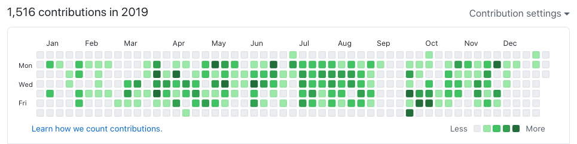

[](LICENSE)
[](https://travis-ci.org/jan-carreras/contributions)
[](https://goreportcard.com/report/github.com/jan-carreras/contributions)
[](https://codeclimate.com/github/jan-carreras/contributions/maintainability)

# GitHub Contributions

GitHub Contributions is a CLI tool for importing commit metadata so that it shows in your
[Contribution Calendar](https://docs.github.com/en/free-pro-team@latest/github/setting-up-and-managing-your-github-profile/viewing-contributions-on-your-profile#contributions-calendar)



## Description

If you contribute to private repositories, or you are switching jobs, and you want to keep your GitHub Contribution
Calendar you can import the commit metadata into one private repository, and your Contribution Calendar will show
all the information about daily commits.  

### How does it work

It scans a directory recursively finding GIT repositories, then looks all the commits you've done, identifying them
by email and imports it to you private GitHub Contribution repository.

Because some repositories may be private, with copyright of third parties (your company, etc) and may contain sensitive 
information, *only* the timestamp of the commit will be imported to the GitHub Contribution repository. Information
that is not imported:

* Original author email
* Commit hash or parent commit information
* Commit message
* Diff
* ...

The timestamp of your commits is considered unique so commits with the same timestamp are just counted once on the GitHub
Contribution Calendar.

If you import commits that are _already_ being shown in your Contribution Calendar will
appear as duplicated.

## Installation

```bash
$ git clone https://github.com/jan-carreras/contributions.git
$ cd contributions
$ make install
```

## Usage

```bash
$ ghc -h
Usage of ghc:
  -dst string
        the contributions repository
  -emails string
        comma separated list of emails
  -github-email string
        the same email as your GitHub account
  -src string
        directory recursively scanned for GIT repositories
```

### Example

```bash
$ ghc -src ~/Documents/projects -emails contact@jcarreras.es,foo@bar.com -dst ~/Documents/github-contributions -github-email contact@jcarreras.es
```

* Find all the GIT repositories under `~/Documents/projects`,
* that have commits with the emails defined in `-emails`, 
* import the commits metadata in `~/Documents/github-contributions` repository,
* with the email defined in `-github-email` . It must be your GitHub email. Read more 
about [what counts as a contribution](https://docs.github.com/en/free-pro-team@latest/github/setting-up-and-managing-your-github-profile/viewing-contributions-on-your-profile#what-counts-as-a-contribution).

To see the changes, create a GitHub private repository and push the new repository defined in `-dst` 
the master branch.

## Contributing

Pull requests are welcome. For major changes, please open an issue first to discuss what you would like to change.

Please make sure to update tests as appropriate.

## License

[MIT](https://choosealicense.com/licenses/mit/)
